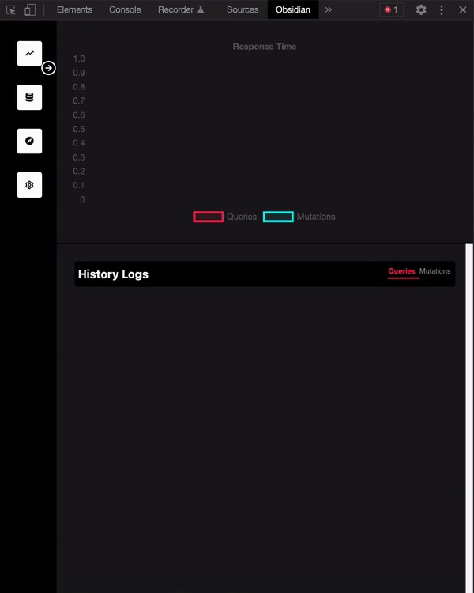

# Obsidian-Developer-Tool

The Obsidian Developer Tool is an easy-to-use chrome developer tool extension designed for applications using Obsidian. With this extension, users can:

- visualize GraphQL query and cache performance metrics 
- send dynamic queries and mutations to a user's database 
- view and evict data from the browser cache

These features require minimal configuration and are designed to cater to the needs of Obsidian developers utilizing Obsidian Wrapper in their applications.

The Obsidian Developer Tool is an open-source developer tool accelerated by OS Labs and developed by [Yurii Shchyrba](https://github.com/YuriiShchyrba),   [Linda Zhao](https://github.com/lzhao15), [Ali Fay](https://github.com/ali-fay), [Anthony Guan](https://github.com/guananthony), [Yasir Choudhury](https://github.com/Yasir-Choudhury)   

# Installation

The Obsidian Developer Tool is currently under the review process to be launched on the Chrome Extension Store. In the meantime, the easiest way to use the developer tool is to build from source and manually add as a chrome extension. To build the latest version, execute the following commands:


```
git clone https://github.com/oslabs-beta/obsidian-developer-tool 
npm install
npm run build
```

Then, in the Chrome Extensions Page (chrome://extensions/), toggle "Developer mode" on in the upper righthand corner, click on "Load unpacked" and navigate to /Obsidian-developer-tool/dist/ and click "Select". The extension should now be loaded and available within chrome developer tools.

# Usage and Configuration
Clone the Obsidian repository [here](https://github.com/open-source-labs/obsidian), and in the Obsidian Wrapper file, on line 10, update ```chromeExtensionId``` to the value of the unique chrome extension ID for the tool you just unpacked in your extensions. This can be found at chrome://extensions/ on the card for your loaded extension.

There is no further configuration necessary. As long as your application is using Obsidian Wrapper (imported as a path to the local file with the updated chrome extension), the devtool will be able to retrieve cache data and query metrics on actions initiated in the app. 

**Performance:** <br/>
Navigate to this tab if you would like to visualize the response time of your GraphQL queries. You can access a log of your queries and mutations, as well as the corresponding response time data. Here you can see the lower response times on subsequent queries for the same data - Obsidian's caching strategies at work!


**Cache:** <br/>
Navigate to this tab to see the data currently in your client-side cache based on queries being made. All of the cached data will appear here, and you also have the ability to manually clear the cache with the 'clear cache' button. 

**Playground:** <br/>
In order to use this feature, you must plug in your server's GraphQL endpoint (ex. http://localhost:3000/graphQL) and click the submit button. You will now be able to write queries as well as mutations in order to retrieve and view your data. 

**Usage Note:**
Use of this developer tool requires Obsidian version 5.0 or greater.

# More information:
Obsidian and Obsidian demo documentation: 
* [Obsidian](https://github.com/open-source-labs/obsidian) 
* [Obsidian Demo](https://github.com/oslabs-beta/obsidian-demo-5.0) 
