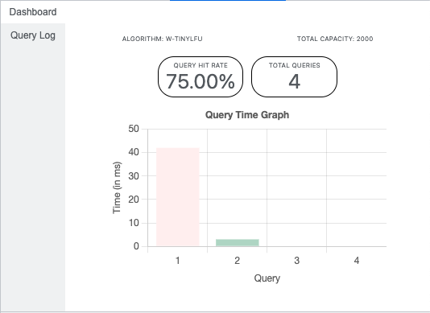
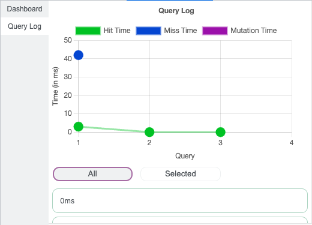

# Obsidian Developer Tool

The Obsidian Developer Tool 8.0 is the revamped DevTool for applications using Obsidian with no additonal configuration needed. It's an easy-to-use chrome developer tool extension where users can:

- visualize client cache performance metrics (i.e. hit ratio, time graphs)
- view previous queries through a query log and client hit, client miss, and mutation time trends

The Obsidian Developer Tool is an open-source developer tool accelerated by OS Labs and developed by [David Kim](https://github.com/davidtoyoukim), [David Norman](https://github.com/DavidMNorman), [Eileen Cho](https://github.com/exlxxn), and [Joan Manto](https://github.com/JoanManto).

# Installation

Currently, the easiest way to use the developer tool is to build from source and manually add as a chrome extension. To build the latest version, please follow the below instructions.

```
git clone https://github.com/open-source-labs/obsidian-developer-tool.git
cd obsidian-developer-tool/client
npm install
npm run build
```

In the Chrome Extensions Page (chrome://extensions/), toggle "Developer Mode" on in the upper righthand corner. Click on the "Load Unpacked" button, and navigate to the client folder of the Obsidian Developer Tool repo. Click "Select", and the developer tool should now be loaded and available in the developer tools panel.

# Features

**Dashboard** <br/>
The default landing page of the Obsidian Developer Tool is the dashboard, where the query hit rate, query total, and query time graph are displayed. These metrics are updated live as the user executes queries and mutations to test their application. Additional details like algorithm used and total capacity can also be viewed in this page.

<br/>

<div></div>

**Query Log** <br/>
The query log is broken up into two parts, the query list and the query graph. Each query in the list can be selected to display details about that query. The query log graph displays each query you've made, organized by whether it was a cache hit, cache miss, or mutation. Clicking on any query node in the graph will isolate that selected query in the list, allowing you to easily check the details of that particular query.

<br/>

<div></div>

**Usage Note** <br/>
Use of this developer tool requires Obsidian version 8.0 or greater.

# More Information
Obsidian and Obsidian Demo documentation:
* [Obsidian](https://github.com/open-source-labs/obsidian)
* [Obsidian Demo](https://github.com/oslabs-beta/obsidian-8.0-demo)